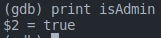
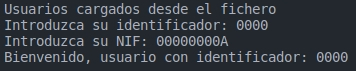
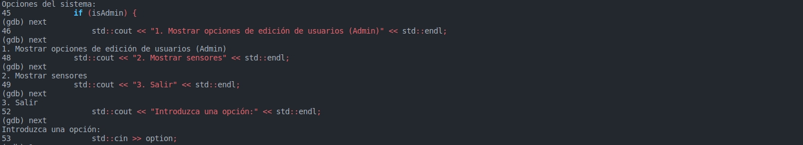
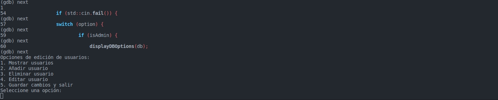
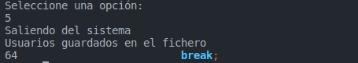
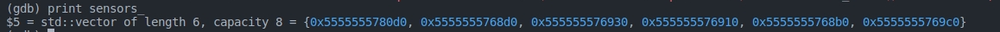
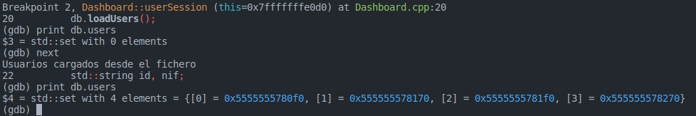

# P8-Ficheros

## Autor:

Daniel Río Alonso

## Objetivo:

Los objetivos de esta práctica son:

1. Manejo de Excepciones: Identificar y controlar situaciones críticas del sistema mediante el manejo de excepciones.
2. Depuración con GDB: Utilizar el depurador GDB para seguir la ejecución del sistema y detectar fallos lógicos.
3. Documentación con Doxygen: Documentar formalmente el sistema utilizando la herramienta Doxygen.
4. Persistencia de Datos: Implementar la funcionalidad para guardar y cargar la información de usuarios desde un archivo, asegurando que los datos se conserven entre ejecuciones.

## Realizacion:

Se ha modificado la clase BDUser con atributos. La clase BDUser gestiona la colección de usuarios y maneja la persistencia de datos en archivos binarios. Se implementaron funciones para agregar, mostrar, buscar y gestionar 
usuarios, junto con el manejo de excepciones. Finalmente, se utilizaron GDB para la depuración y Doxygen para la documentación formal del sistema.

## Instrucciones
1. Compilacion.
   Para compilar todo nuestro programa introduzimos el comando:
   $> g++ -Wall -g -o main *.cpp -IUser/include
    
2. Ejecucion
   Para su posterior ejecucion simplemente le ordenamos:
   $> ./main

## Depuracion

Se imprime la variable para verificar si el usuario es o no administrador

Se rellenan los datos del usuario para iniciar sesion

Se muestran las opciones del sistema para el usuario

Se elige cualquiera de las opciones segun lo requerido por el usuario

Se selecciona la opcion 5, para salir del sistema y guardar los usuarios en el fichero con la base de datos

Se imprime la informacion del vector con la lista de sensores

Se imprime la informacion con la lista de usuarios del sistema hasta el momento
